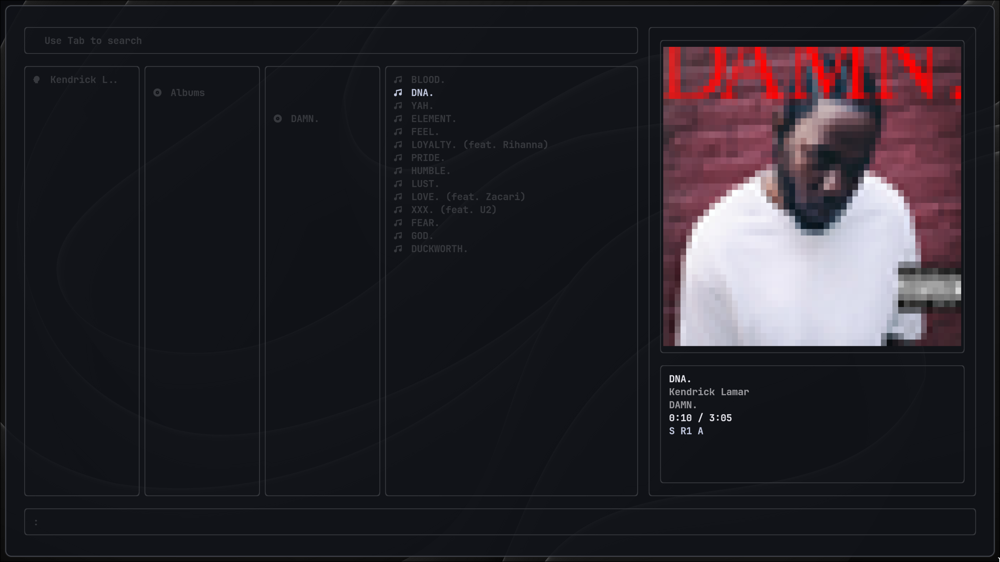

# Apple Music TUI

A Terminal User Interface (TUI) for Apple Music, using [Cider](https://cider.sh/) as the backend player.




## 🌟 Features

- **Full Playback Control** - Play, pause, skip, shuffle, repeat modes
- **Search** - Search songs, albums, artists, and playlists
- **Station Support** - Play Apple Music radio stations
- **Album Art Display** - View album covers in your terminal
- **Auto-play** - Automatically create stations from recently played tracks
- **Customizable Styles** - Hot-reload custom color schemes and borders
- **Keyboard-Driven** - Vim-inspired navigation and commands
- **Responsive Layout** - Adapts to terminal width (wide/column modes)

## 📜 Requirements

- **Node.js** (v16 or higher)
- **[Cider](https://cider.sh/)** running on `localhost:10767`
  - Login Cider with your Apple Music account (subscription required)
  - Enable `WebSockets API`
  - Disable `Require API Token`
- **Nerd Fonts** for icon display (recommended: [JetBrains Mono Nerd Font](https://www.nerdfonts.com/))
- **Apple Music Subscription** with active Cider session

## 🏗️ How It Works

This application uses a **split-responsibility architecture** where the TUI and Cider work together seamlessly:

### Apple Music TUI (This Application)

- Provides the terminal user interface and keyboard navigation
- Manages the **virtual playback queue** (shuffle, repeat, track order)
- Handles all user interactions and UI rendering
- Controls playback logic (what plays next, when to auto-play)
- Fetches and displays music metadata (album art, track info)

### Cider (Backend Player)

- Connects to Apple Music services with your account
- Provides the **Apple Music API bridge** (authentication, catalog access)
- Handles actual **audio playback** (the sound you hear)
- Streams music and manages audio output
- Excellent audio enhancements and features

### Why This Design?

This architecture gives you the best of both worlds: Cider handles the complex Apple Music integration and audio playback, while the TUI provides a keyboard-driven, customizable interface with full control over your listening experience. For most tracks, the TUI manages everything; for radio stations, it delegates playback control to Cider's native station handling.

### TL:DR

- Cider stays in the background and wait for the API requests from the TUI with the song's id.
- TUI manages the playback queue, UIUX, and fetching/rendering.

For technical details, see [QUEUE.md](./markdowns/QUEUE.md) and [STATION.md](./markdowns/STATION.md).

## 🚀 Installation

### Use NPM (Recommended)

```bash
npm install -g apple-music-tui
```

### Build from Source

```bash
# Clone the repository
git clone https://github.com/Mabylife/apple-music-tui.git
cd apple-music-tui

# Install dependencies
npm install

# Build the project
npm run build

# Run the TUI
npm start
```

development mode

```bash
npm run dev
```

## ⌨️ Usage

### Navigation

| Key                          | Action                           |
| ---------------------------- | -------------------------------- |
| `↑` / `↓`                    | Navigate up/down                 |
| `→`                          | Enter selected item / Play track |
| `←` / `Backspace` / `Delete` | Go back                          |

### Playback Control

| Key        | Action                          |
| ---------- | ------------------------------- |
| `Space`    | Play / Pause                    |
| `Ctrl + →` | Next track                      |
| `Ctrl + ←` | Previous track                  |
| `Ctrl + S` | Toggle shuffle                  |
| `Ctrl + R` | Toggle repeat (off → one → all) |
| `Ctrl + A` | Toggle auto-play                |

- `RE`/`R1` -> Repeat playlist / Repeat one track
- `S` -> Shuffle mode
- `A` -> Auto-play mode

### Search & Commands

| Key                    | Action                                                                     |
| ---------------------- | -------------------------------------------------------------------------- |
| `Tab`                  | Enter search mode                                                          |
| `Enter`                | Execute search                                                             |
| `ESC`                  | Cancel / Exit mode                                                         |
| `:`                    | Enter command mode                                                         |
| `:q` / `:quit` / `:qa` | Quit application                                                           |
| `:home`                | Return to home (args: `recommendations` / `playlists` / `recently-played`) |
| `:vol <num>`           | Set volume (0-100)                                                         |
| `:seek <time>`         | Seek to time (e.g., `1,28` or `88` seconds)                                |

For detailed usage instructions, see [USAGE.md](./markdowns/USAGE.md).

## ⚙️ Configuration

Configuration files are stored in:

- **Linux**: `~/.config/apple-music-tui/`
- **macOS**: `~/Library/Application Support/apple-music-tui/`
- **Windows**: `%APPDATA%\apple-music-tui\`

### Style Configuration

Edit `style.css` to customize colors and borders (hot-reload supported):

```css
foreground-color: white;
muted-foreground-color: gray;
highlight-color: cyan;
error-color: red;
border-style: round;
```

Available options and explanations can be found in [STYLE.md](./markdowns/STYLE.md).

### Home Page Configuration

Edit `config.json` to customize the home page sections:

available options are `recommendations`, `playlists`, and `recent`.

```json
{
  "defaultHome": "recommendations"
}
```

### Playback State

Playback modes (shuffle, repeat, autoplay) are persisted in `playback-state.json`.

## 🎯 What's Next

If you are interested in contributing or following the development, here are some planned features:

### Auto launch Cider in the background

This should be next primary feature. Currently, you need to manually start Cider before launching the TUI.

Future versions may include an option to automatically launch Cider in the background when starting the TUI, simplifying the setup process.

### High-resolution album art

Right now, the album are rendered in low resolution using half-block characters. but if user's terminal supports it, we can render higher-resolution images using more advanced techniques.

### More bug hunting

This TUI app is still in active development. Expect more bug fixes and performance improvements in future releases.

### More responsive layouts

Improved layout options for various terminal sizes and orientations.

### More customization options

Additional style and behavior customization options, such as themes, keybindings, and more.

## 🛠️ Tech Stack

- [Ink](https://github.com/vadimdemedes/ink) - React for CLIs
- [React](https://react.dev/) - UI component framework
- [TypeScript](https://www.typescriptlang.org/) - Type safety
- [Socket.io](https://socket.io/) - Real-time playback updates
- [Cider RPC](https://cider.sh/) - Apple Music API bridge
- [ink-picture](https://github.com/endernoke/ink-picture) - Album art rendering

## 📖 Documentation

- [Usage Guide](./markdowns/USAGE.md) - Detailed keyboard shortcuts and navigation
- [Queue System](./markdowns/QUEUE.md) - How the virtual queue works
- [Station Mode](./markdowns/STATION.md) - Radio station playback mechanics
- [Auto-play](./markdowns/AUTOPLAY.md) - Automatic station creation
- [Style Customization](./markdowns/STYLE.md) - Customize colors and borders
- [Project Structure](./markdowns/STRUCTURE.md) - Architecture overview

There all in `/markdowns/` folder.

## 🤝 Contributing

Contributions are welcome! Please feel free to submit a Pull Request.

I really appreciate any help with bug fixes, new features, or documentation improvements.
I'm not a professional developer, so your contributions will help make this project better for everyone.

## 📝 License

This project is licensed under the MIT License - see the [LICENSE](LICENSE) file for details.

## 🙏 Acknowledgments

- [Cider](https://cider.sh/) - For providing the Apple Music API bridge and the pleasant audio playback features.
- [Ink](https://github.com/vadimdemedes/ink) - For the amazing TUI framework
- [Apple Music API](https://developer.apple.com/documentation/applemusicapi/) - For music metadata

## ⚠️ Disclaimer

This project is not affiliated with Apple Inc. Apple Music is a trademark of Apple Inc.

---

**Made with ❤️ by Mabylife**
